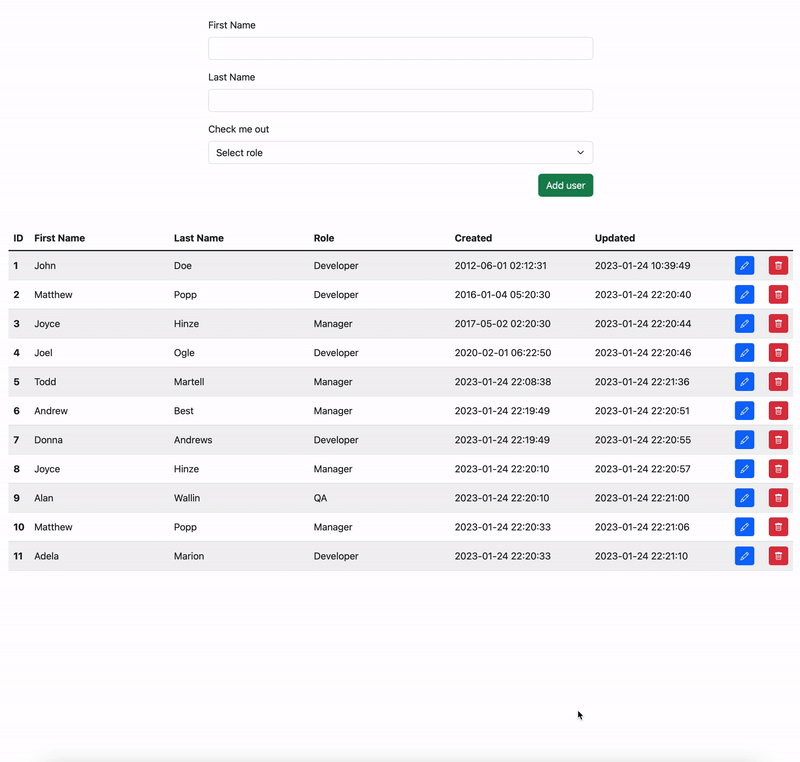
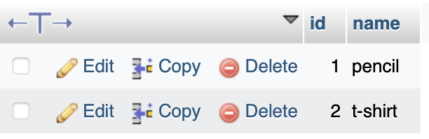
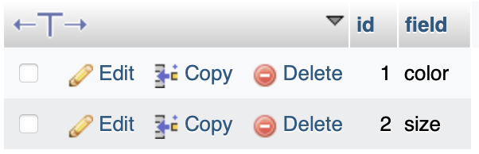
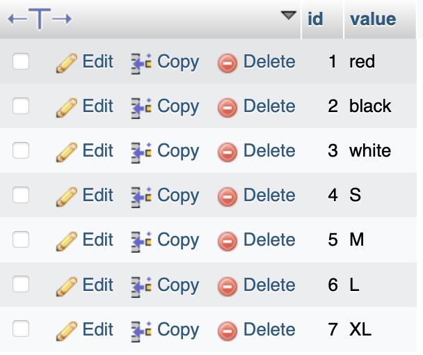
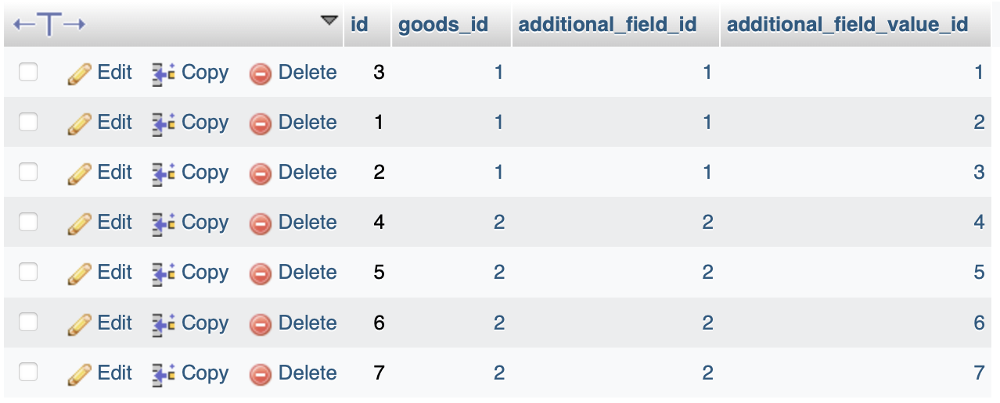
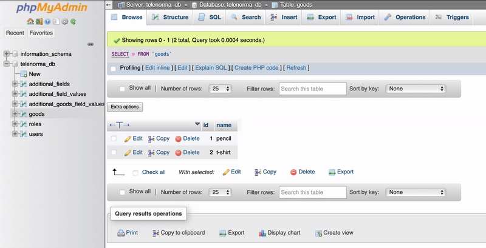

# Telenorma

## 1. User manager

### Technical implementation
Project use Docker containers:
- for DB is **mysql:5**
- for php server **php:8.1-rc-apache**
- for phpMyAdmin **phpmyadmin/phpmyadmin:latest**

Functionality
- HTML page included [scripts.js](public/assets/js/scripts.js) with all functions and ajax request methods
- All request send to serve side by REST API:
```commandline
*** USERS ***
GET: /api/users            (get all users)
GET: /api/users?id=USER_ID (get all user by id USER_ID)
PUT: /api/users            (add new user) 
POST: /api/users           (update new user)

*** ROLES ***
POST: /api/roles           (get all roles)
```
- [Users API file](public/api/users.php) and [Users Class file](public/api/classes/users.php)
- [Roles API file](public/api/roles.php) and [Roles Class file](public/api/classes/roles.php)

### How to run project

#### Locally
1. Install docker compose on you PC/Mac - [follow this link documentation](https://docs.docker.com/compose/install/)
2. In root folder of repository run command in Terminal `docker compose -f docker-compose.yml up -d --build`
3. In processing run 3 containers, to DB container will run sql script [init_db.sql](/db_init/init_db.sql) which contain initialisation tables and content of tables

After when you will see this rows in Terminal:
```commandline
[+] Running 3/0
 ⠿ Container telenorma_db          Running
 ⠿ Container telenorma_phpmyadmin  Running
 ⠿ Container telenorma_php         Running
```
5. Go to browser and visit this address: `http://localhost:1111`

#### On server
1. Copy all files from folder `public` to root folder on server
2. Import SQL script to DB on server
3. Open address of server in browser

Demo how it's works:


## 2. JOIN Tables

### Tables:

**goods**



**additional_fields**



**additional_field_values**



**additional_goods_field_values**



### SQL request for get `goods` with `id = 1`
```mysql
SELECT 
    goods.name AS 'Product Name', 
    additional_fields.field AS 'Additional Field Name', 
    additional_field_values.value AS 'Additional Field Value' 
FROM 
    goods 
    JOIN additional_goods_field_values ON goods.id = additional_goods_field_values.goods_id 
    JOIN additional_fields ON additional_goods_field_values.additional_field_id = additional_fields.id 
    JOIN additional_field_values ON additional_goods_field_values.additional_field_value_id = additional_field_values.id 
WHERE goods.id = 1;
```

### Request by `php`

include file with connection code [database.php](public/api/database.php)

```php
<?php
require_once("database.php");

$database = new Database();
$db = $database->getConnection();
$sqlQuery = "SELECT 
                goods.name AS 'Product Name', 
                additional_fields.field AS 'Additional Field Name', 
                additional_field_values.value AS 'Additional Field Value' 
             FROM 
                goods 
                JOIN additional_goods_field_values ON goods.id = additional_goods_field_values.goods_id 
                JOIN additional_fields ON additional_goods_field_values.additional_field_id = additional_fields.id 
                JOIN additional_field_values ON additional_goods_field_values.additional_field_value_id = additional_field_values.id 
             WHERE goods.id = 1";

$stmt = $db->prepare($sqlQuery);
$stmt->execute();
$dataRow = $stmt->fetch(PDO::FETCH_ASSOC);
```
Same code on #74 row in file [users.php](public/api/classes/users.php#L74)

Demo:




